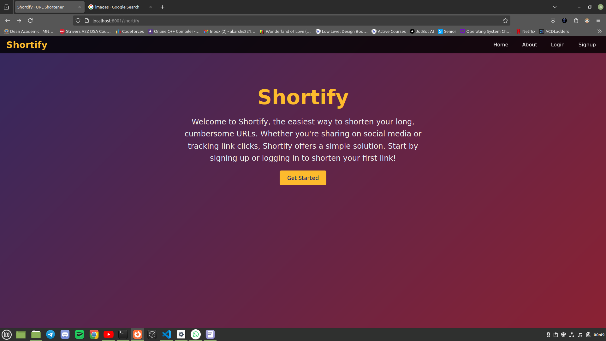

# Shortify

**Shortify** is a URL shortening tool built using **Node.js** and **Express.js**, designed to convert long URLs into shorter, manageable, and trackable links. It includes features such as real-time click tracking and seamless redirection, with a responsive design to ensure compatibility across devices.

## Features
- **URL Shortening**: Converts long URLs into short, easy-to-share links.
- **Real-time Click Tracking**: Monitors user activity on shortened URLs.
- **Authentication**: Utilizes **JWT Tokens** for secure login and user session management.
- **Authorization**: Middleware implemented to restrict access to certain routes.
- **Database Integration**: Uses **MongoDB** to store shortened URLs and user data.
- **EJS Templating**: For rendering dynamic content on the frontend.

## Technologies Used
- **Node.js**: Backend server.
- **Express.js**: Framework for routing and handling requests.
- **MongoDB**: Database for storing URLs and user information.
- **JWT (JSON Web Token)**: For authentication and secure user sessions.
- **Mongoose**: ODM for MongoDB.
- **EJS**: Template engine for rendering views.
- **Bootstrap**: Responsive design framework.
  
## Project Structure
- **Controllers**: Manages business logic and interactions with models.
- **Middlewares**: Handles JWT validation and route protection.
- **Models**: Defines the schema for URLs and users.
- **Routes**: API endpoints for URL creation, redirection, and authentication.
- **Services**: Utility functions for various backend tasks.

## Screenshots

- **Home Page**:  
  
  
- **User Dashboard (After Login)**:  
  

## Installation

1. Clone the repository:
   ```bash
   git clone https://github.com/Akarsh2012/Shortify.git
2. Install Dependencies
   ```bash
   npm install
   ```
## Set up environment variables:
- **JWT_SECRET**: Secret key for JWT.
- **MONGO_URI**: Connection string for MongoDB.

## Run the Project
   ```bash
   npm start
```
## Usage
- Access the application at: https://shortify-n3ul.onrender.com/shortify
- Use the provided form to shorten URLs and track analytics.

## Future Improvements 
- **Link Expiration**:  Implement a feature that allows users to set an expiration date for shortened URLs, automatically removing them after the set date.
- **Validity of the Original link**: To ensure that the original link is valid or not.
- **Collision Handling**: Implement or modify the short id logic by continuously generating shortid till we did not get a unique one.
  
## Contributing
- Contributions are welcome. Please fork the repository and submit a pull request.

   
